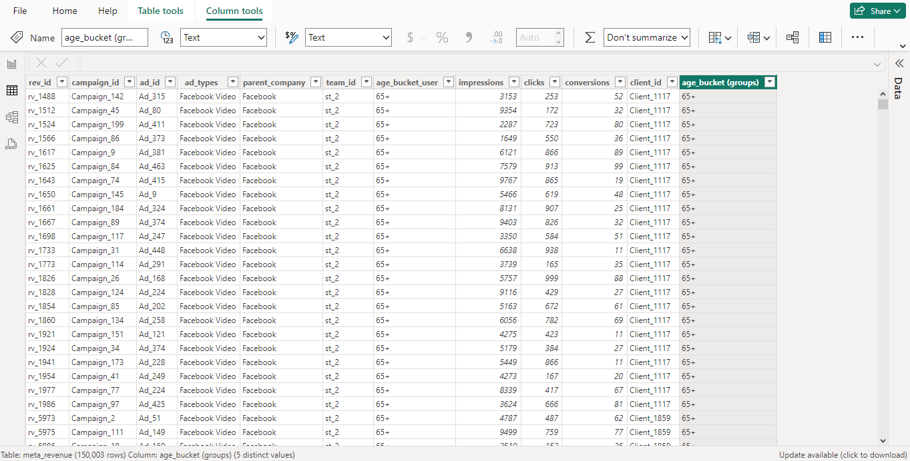
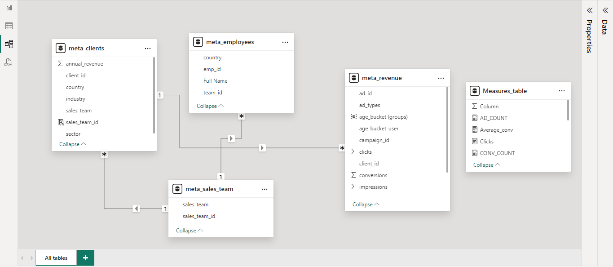
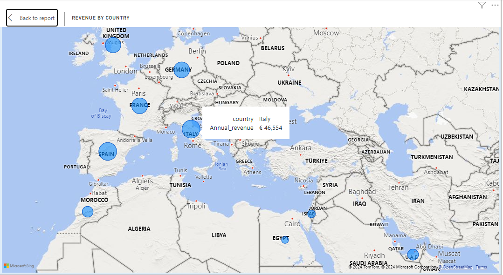
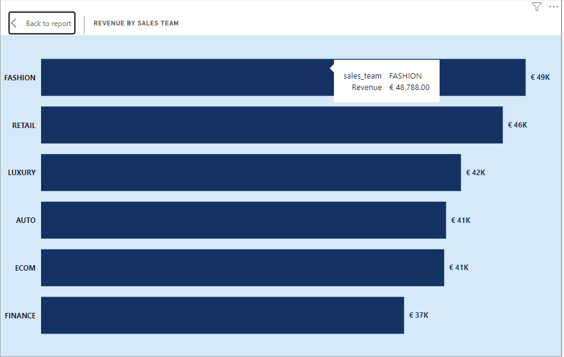

# Meta_Ads_Analysis
## By Joy George

---
## INTRODUCTION
A project on Meta Ads Analysis, this project was carried out to analyze the effect our ads had on facebook and instagram mainly
## Problem statement
* What country had the highest revenue ?
* What sales team generated the highest revenue ?
---
## Data Sourcing
* My Data was gotten from a friend
---
## Skills Demonstrated
* Data Cleaning - I cleaned my data using power query, i removed duplicates , replaced blank rows

* Data Modeling - I connected the facts table to the dimensional tables

## Data Visualization

## Key Insight 
*

*

# Conclusion
